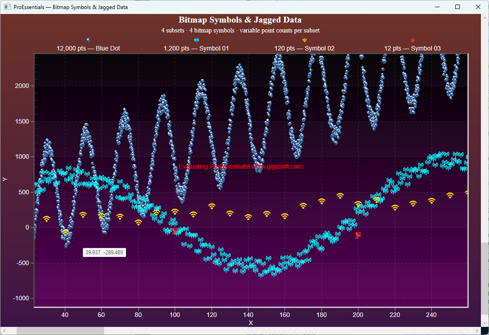

# ProEssentials WPF — Bitmap Symbols & Jagged Data

A ProEssentials v10 WPF .NET 8 demonstration combining two `PesgoWpf`
features: custom PNG bitmap symbols as data point markers, and jagged data
where each subset has a different number of points.



➡️ [gigasoft.com/examples](https://gigasoft.com/examples)

---

## What This Demonstrates

| Subset | Points | Symbol | Strategy |
|--------|--------|--------|----------|
| 0 | 12,000 | `symbolBlueDot.png` | `Colorize=false` — pre-colored, renders native colors |
| 1 | 1,200 | `symbol01.png` | `Colorize=true` — silhouette tinted cyan by SubsetColors |
| 2 | 120 | `symbol02.png` | `Colorize=true` — silhouette tinted gold by SubsetColors |
| 3 | 12 | `symbol03.png` | `Colorize=true` — silhouette tinted red by SubsetColors |

---

## Required Bitmap Files

Place these PNG files in the same folder as the built executable:

```
symbolBlueDot.png   — pre-colored blue dot (Colorize=false)
symbol01.png        — dark silhouette on transparent background (Colorize=true)
symbol02.png        — dark silhouette on transparent background (Colorize=true)
symbol03.png        — dark silhouette on transparent background (Colorize=true)
```

---

## ProEssentials Features Demonstrated

### Bitmap Resource Symbols (Example 140 pattern)

Each `WorkingBitmap` slot holds one PNG file. Subsets reference slots via:

```csharp
SubsetPointTypes[s] = (PointType)(10001 + workingBitmapIndex);
```

Standard `PointType` enum values stay below 100. Values ≥ 10001 are
interpreted as bitmap resource slot references by the engine.

#### Two Bitmap Strategies

**`Colorize = false` — Pre-colored bitmap:**

```csharp
Pesgo1.PePlot.Bitmaps.WorkingBitmap = 0;
Pesgo1.PePlot.Bitmaps.Filename      = "symbolBlueDot.png";
Pesgo1.PePlot.Bitmaps.Colorize      = false;  // render native colors
Pesgo1.PePlot.Bitmaps.Style         = ResourceBitmapStyle.SmallCentered;
```

The bitmap renders exactly as stored. Used for pre-colored images (blue dot,
3D sphere renders, complex icons) where tinting would look wrong. The subset's
`SubsetColors` entry only affects the legend color swatch, not the symbol.

**`Colorize = true` — Silhouette tinted by SubsetColors:**

```csharp
Pesgo1.PePlot.Bitmaps.WorkingBitmap = 1;
Pesgo1.PePlot.Bitmaps.Filename      = "symbol01.png";  // dark shape on transparent bg
Pesgo1.PePlot.Bitmaps.Colorize      = true;             // tinted by SubsetColors[1]
Pesgo1.PePlot.Bitmaps.Style         = ResourceBitmapStyle.SmallCentered;
```

The bitmap source should be a dark shape on a transparent background.
ProEssentials tints it using the subset's `SubsetColors` entry. One PNG
file produces any color — one shape, unlimited color variants.

#### Compact Setup Pattern

```csharp
var bitmaps = new (int slot, string file, bool colorize)[]
{
    (0, "symbolBlueDot.png", false),
    (1, "symbol01.png",      true),
    (2, "symbol02.png",      true),
    (3, "symbol03.png",      true),
};

foreach (var (slot, file, colorize) in bitmaps)
{
    Pesgo1.PePlot.Bitmaps.WorkingBitmap = slot;
    Pesgo1.PePlot.Bitmaps.Filename      = file;
    Pesgo1.PePlot.Bitmaps.Colorize      = colorize;
    Pesgo1.PePlot.Bitmaps.Style         = ResourceBitmapStyle.SmallCentered;
}
```

#### WMF/EMF Export

Bitmap resource symbols cannot be represented in pure vector format.
Disable WMF and EMF export when using them:

```csharp
Pesgo1.PeUserInterface.Dialog.AllowWmfExport = false;
Pesgo1.PeUserInterface.Dialog.AllowEmfExport = false;
```

PNG export works correctly at any resolution.

---

### Jagged Data (Example 142 pattern)

`JaggedData = true` allows each subset to have an independent point count:

```csharp
Pesgo1.PeData.JaggedData = true;
Pesgo1.PeData.Subsets    = 4;
Pesgo1.PeData.Points     = 1;  // auto-adjusts to max subset count on reinitialize
```

**IMPORTANT:** JaggedData requires `RenderEngine = Direct2D`. Direct3D does
not support the per-subset variable point count architecture.

#### Pre-Allocation

Setting the last element of each subset before the data loop prevents
incremental internal reallocations:

```csharp
Pesgo1.PeData.X[0, 11999] = 0f;  Pesgo1.PeData.Y[0, 11999] = 0f;
Pesgo1.PeData.X[1,  1199] = 0f;  Pesgo1.PeData.Y[1,  1199] = 0f;
// ...
```

This is the validated .NET pre-allocation pattern. `SetJaggedPointsX/Y`
exist only in the OCX/VBA API, not in .NET.

#### FastCopyFromJagged — Block Data Load

Build a `float[]` array per subset, then copy in one call:

```csharp
float[] xData = new float[count];
float[] yData = new float[count];

for (int p = 0; p < count; p++)
{
    xData[p] = (p + 1) * stepX;
    yData[p] = /* ... */;
}

Pesgo1.PeData.X.FastCopyFromJagged(xData, subsetIndex);
Pesgo1.PeData.Y.FastCopyFromJagged(yData, subsetIndex);
```

`FastCopyFromJagged(source, subsetIndex)` performs a single `memcpy` into
that subset and sets its size from the source array length. This is
significantly faster than spoon-feeding `Y[s,p]` element by element for
large point counts, and produces cleaner, more readable code.

---

## Controls

| Input | Action |
|-------|--------|
| Left-click drag | Zoom box |
| Mouse wheel | Zoom both axes |
| Right-click | Context menu — PNG export, print, customize |

---

## Prerequisites

- Visual Studio 2022
- .NET 8 SDK
- Bitmap PNG files in the executable output directory

---

## How to Run

```
1. Clone this repository
2. Copy symbolBlueDot.png, symbol01.png, symbol02.png, symbol03.png
   to the project root (they will be copied to the output on build,
   or place them directly in bin\x64\Debug\net8.0-windows\)
3. Open BitmapSymbolsJaggedData.sln in Visual Studio 2022
4. Build → Rebuild Solution (NuGet restore is automatic)
5. Press F5
```

---

## NuGet Package

References
[`ProEssentials.Chart.Net80.x64.Wpf`](https://www.nuget.org/packages/ProEssentials.Chart.Net80.x64.Wpf).
Package restore is automatic on build.

---

## Related Examples

- [WPF Log-Log Axes & Quick Annotation Drag Measure](https://github.com/GigasoftInc/wpf-chart-log-log-axes-drag-measure-quick-annotations-proessentials)
- [WPF Multi-Axis Layout Explorer](https://github.com/GigasoftInc/wpf-chart-multi-axis-layout-explorer-proessentials)
- [All Examples — GigasoftInc on GitHub](https://github.com/GigasoftInc)
- [Full Evaluation Download](https://gigasoft.com/net-chart-component-wpf-winforms-download)
- [gigasoft.com](https://gigasoft.com)

---

## License

Example code is MIT licensed. ProEssentials requires a commercial
license for continued use.
